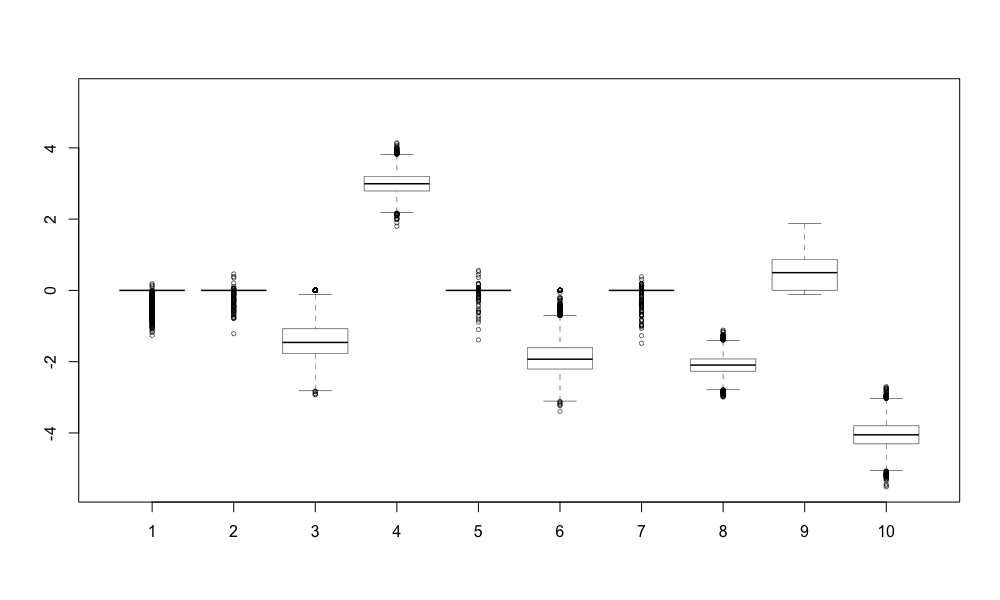

# General Bayesian Shriankge Using Neuronized Priors for Linear Regression Models


Examples:
```
rm(list = ls(all.names = TRUE))
library(NPrior)
library(MASS)
data(Boston)
str(Boston)
attach(Boston)
X = cbind(crim,indus,nox,rm,age,dis,tax,ptratio,black,lstat)
X = scale(X)
y = medv
y = y-mean(y)
n = nrow(X)
p = ncol(X)
fit_default = NPrior_run(X, y)
fit_HS1 = NPrior_run(X, y, prior = "HS", eta = 1)
fit_HS2 = NPrior_run(X, y, prior = "HS", eta = p^-3)
fit_c1 = NPrior_run(X, y, prior = "SpSL-c", a0 = 1, b0 = 1, prior_sig_type = 1) 
fit_c2 = NPrior_run(X, y, prior = "SpSL-c", a0 = 1, b0 = p, prior_sig_type = 0) 
fit_g1 = NPrior_run(X, y, prior = "SpSL-g", alpha0_update = F, alpha0 = 5) 
fit_g2 = NPrior_run(X, y, prior = "SpSL-g", alpha0_update = F, alpha0 = 5, prior_sig_type = 1) 
fit_BL = NPrior_run(X, y, prior = "BL") 

boxplot(t(fit_default$THETA), ylim=c(-5.5,5.5))
boxplot(t(fit_HS1$THETA), ylim=c(-5.5,5.5))
boxplot(t(fit_HS2$THETA), ylim=c(-5.5,5.5))
boxplot(t(fit_c1$THETA), ylim=c(-5.5,5.5))
boxplot(t(fit_c2$THETA), ylim=c(-5.5,5.5))
boxplot(t(fit_g1$THETA), ylim=c(-5.5,5.5))
boxplot(t(fit_g2$THETA), ylim=c(-5.5,5.5))
boxplot(t(fit_BL$THETA), ylim=c(-5.5,5.5))
```

A boxplot of the posterior samples of coefficients for the Boston housing data set: 

